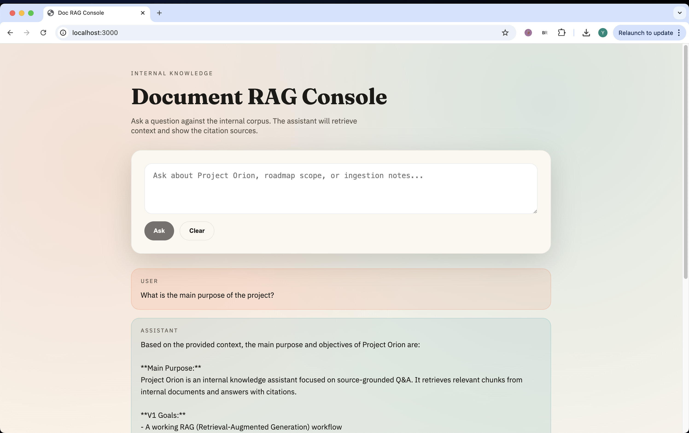
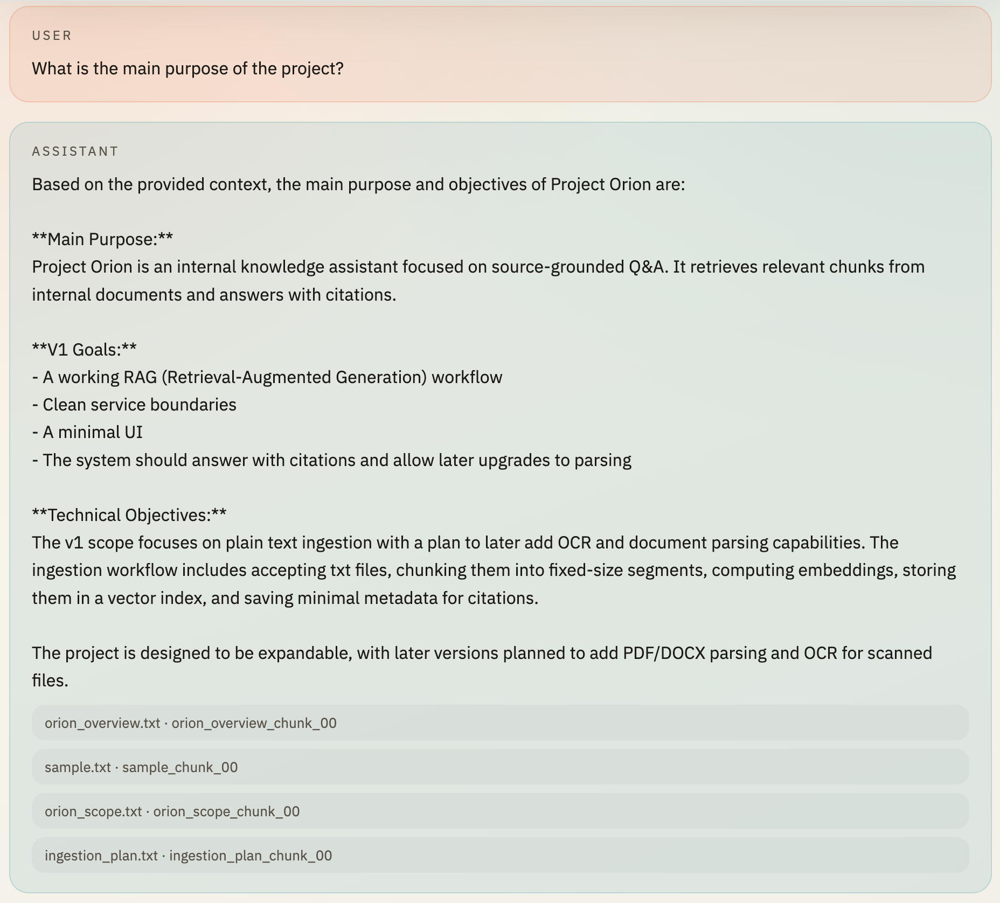

# Document RAG Console

## 1. Project Goal

Build a small but extensible enterprise-style document assistant for messy internal knowledge.

The first version prioritizes:

- A clean backend architecture
- A working RAG / agent pipeline
- Clear service boundaries
- An easy path to add parsing, OCR, vector DB, and cloud deployment later

The first version does not prioritize:

- Production-grade auth
- Full database modeling
- Full OCR pipeline
- Polished frontend
- AWS deployment in v1

---

## 2. What Is Implemented Now

**End-to-end**

- LangGraph-driven RAG flow with query rewrite, tool-calling retrieval, and citation formatting
- Local retrieval over `backend/data/raw/*.txt`
- Chroma persistent index under `backend/data/vectorstore/chroma`
- Citation list returned with each answer
- Optional Claude tool-calling if `ANTHROPIC_API_KEY` is set
- Stub answer generator for local testing without a key
- FastAPI endpoints: `POST /api/ask`, `POST /api/ingest/text`, `GET /api/documents`, `GET /api/health`
- Next.js chat UI that shows answers with source + chunk_id

**Main Components (Implemented Parts)**

**RAG / Agent Service (LangGraph)**

- Receive user query
- Optional query rewrite
- Retrieve relevant chunks
- Assemble context
- Call LLM
- Return grounded answer with citations

Current v1 flow (LangGraph):

```text
User Question
   |
   v
FastAPI /api/ask
   |
   v
rewrite_node (optional query rewrite via LLM)
   |
   v
agent_node
   |
   |-- if docs empty & attempt == 0 (prefetch)
   |      -> tools_node (retrieve_docs_tool)
   |      -> store docs in state
   |      -> back to agent_node
   |
   |-- else (docs present)
   |      -> inject context into messages (if no tool_result)
   |      -> call LLM with tools enabled
   |      -> if LLM tool_use: tools_node (retrieve_docs_tool) -> agent_node
   |      -> else: finalize answer
   |
   v
format_citations_node (build citations from docs)
   |
   v
FastAPI response: {answer, citations, llm_mode}
```

Interaction details:

1. **Rewrite**: if Claude is configured, `rewrite_query()` rewrites the user question into a retrieval-friendly query.
2. **Prefetch retrieval** (forced on first pass): if no docs and `attempt == 0`, call `retrieve_docs_tool` and store `docs` in state (no tool_result block yet).
3. **Context injection**: when docs exist and there is no tool_result, a context message is injected so the LLM answers strictly from retrieved chunks.
4. **Tool calling**: Claude can request `retrieve_docs` again; that path returns tool_result back into messages.
5. **Answer**: the LLM produces the final answer; if it returns empty, we fall back to a summary from retrieved docs.
6. **Citations**: `format_citations_node` converts retrieved chunks into a stable citation list.

Retrieved chunk structure (used for citations):

```text
RetrievedChunk {
  text: string
  source: filename
  chunk_id: string
  score: float  // score = 1 / (1 + distance)
}
```

**Frontend (Next.js)**

- Chat UI
- Shows retrieved sources / citations

**Backend API (FastAPI)**

- Chat / ask endpoint
- Ingest txt endpoint
- Health endpoint
- Document list endpoint

**Document Service (v1 placeholder)**

- Accept txt documents
- Chunk them
- Attach metadata
- Send embeddings to vector store

**Vector Store (Chroma)**

- Store embeddings
- Retrieve top-k chunks

**Metadata DB (v1 temporary)**

- JSON metadata file at `backend/data/metadata.json`

**LLM Layer**

- Provider wrapper in `backend/app/llm/claude.py`
- Optional Anthropic Claude, stub mode if not configured

---

## 3. Target Architecture

```text
[Frontend: Next.js / React]
        |
        | HTTP/JSON
        v
[Backend API: FastAPI]
        |
        | calls
        +----------------------+
        |                      |
        v                      v
[RAG / Agent Service]     [Document Service]
 (LangGraph)              (parse / OCR / ingest)
        |                      |
        | reads/writes         | reads/writes
        v                      v
[Metadata DB: Postgres]   [Raw File Storage]
        |
        | doc/chunk metadata
        v
[Vector Store]
        |
        | retrieval results
        v
[LLM Provider / SDK]
(OpenAI / Anthropic / etc.)
```

---

## 4. Frontend and Backend

**Frontend (Next.js)**

- Single-page chat UI
- Shows answers with citation sources (source + chunk_id)
- API base can be configured via `NEXT_PUBLIC_API_BASE`

**Backend (FastAPI)**

- `POST /api/ask` takes a question and returns `{answer, citations, llm_mode}`
- `POST /api/ingest/text` writes txt, updates metadata, resets the index
- `GET /api/documents` lists ingested txt files and metadata
- `GET /api/health` health check

---

## 5. Tech Stack

- Frontend: Next.js 14, React 18, TypeScript
- Backend: FastAPI, Pydantic
- RAG orchestration: LangGraph
- Vector store: Chroma
- Embeddings: Sentence-Transformers (`all-MiniLM-L6-v2`)
- LLM: Anthropic Claude (optional; stub mode if not configured)
- Local data: txt corpus + JSON metadata

---

## 6. Demo

**Chat**

The main chat interface. It sends a question to `POST /api/ask` and renders the answer plus citations.



**Chat History**

A longer conversation showing multiple requests, responses, and citations.


